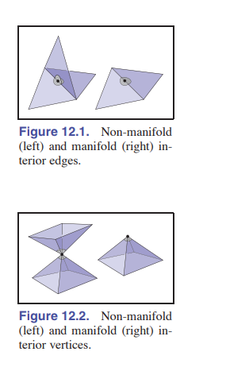

#  12: Data Structures for Graphics 

## 12.1 Triangle meshes

三角面片通常用于表示表面，因此一个网格不仅仅是一组不相关的三角形的集合，而是一组通过共享顶点和边相互连接以形成单一连续表面的三角形网络。这是关于网格的一个关键见解：与相同数量的不相关三角形相比，我们应该能够更高效地处理一个网格。

表示三角网格所需的最低信息包括一组三角形（由顶点三元组组成）和它们的顶点在三维空间中的位置。但是，许多（如果不是大多数）程序需要能够在顶点、边或面上存储额外的数据，以支持纹理映射、着色、动画和其他操作。最常见的是顶点数据：每个顶点可以具有材质参数、纹理坐标、辐照度等参数，这些参数的值在整个表面上发生变化。然后，这些参数会在**线性插值**的方式跨越每个三角形，以定义整个网格表面上的连续函数。然而，偶尔也重要能够存储边缘或面的数据。

### 12.1.1 Mesh topology

 将网格视为类似于表面的想法可以通过对网格拓扑的约束来**形式化**，即考虑三角形如何连接在一起，而不关心顶点的位置。许多算法只能在具有可预测连接性的网格上运行，或者在这种网格上更容易实现。对网格拓扑的最简单和最严格的要求是表面必须是**流形(manifold)的。流形网格是“无缝的(watertight)”——它没有间隙，将表面内部的空间与外部空间分开**。在整个网格上，它看起来也像一个表面。 

一个流形表面应该满足以下条件：

-  Every edge is shared by exactly two triangles. 

-  Every vertex has a single, complete loop of triangles around it 

 最后，在许多应用中，能够区分表面的“前面”（或“外部）”与“后面”（或“内部”）是很重要的，这被称为表面的定向。对于单个三角形，我们根据顶点的排列顺序来定义方向：外法向是三角形的三个顶点按逆时针顺序排列的一侧。如果一个连通的网格的所有三角形都就表面的外法向达成一致，那么这个网格就是一致定向的，而这只有在每一对相邻的三角形都一致定向的情况下才成立。 

 在一对一致定向的三角形中，**两个共享的顶点在两个三角形的顶点列表中的顺序是相反的**（见图12.4）。重要的是方向的一致性——有些系统使用顺时针而不是逆时针顺序来定义前面。图12.5。一个三角形化的莫比乌斯带，这是不可定向的。任何具有非流形边的网格都无法一致定向。但是，一个网格也可能是一个有效的有边界流形（甚至是一个流形），但却没有一种一致的方式来定向三角形——它们不是可定向的表面。图12.5中所示的莫比乌斯带就是一个例子。然而，在实践中，这很少是一个问题。 

### 12.1.2 Indexed Mesh Storage

