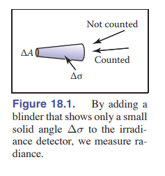
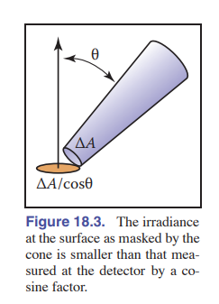
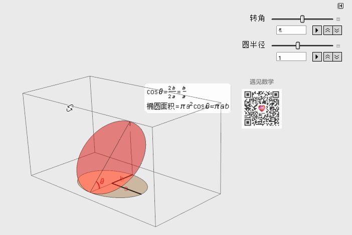
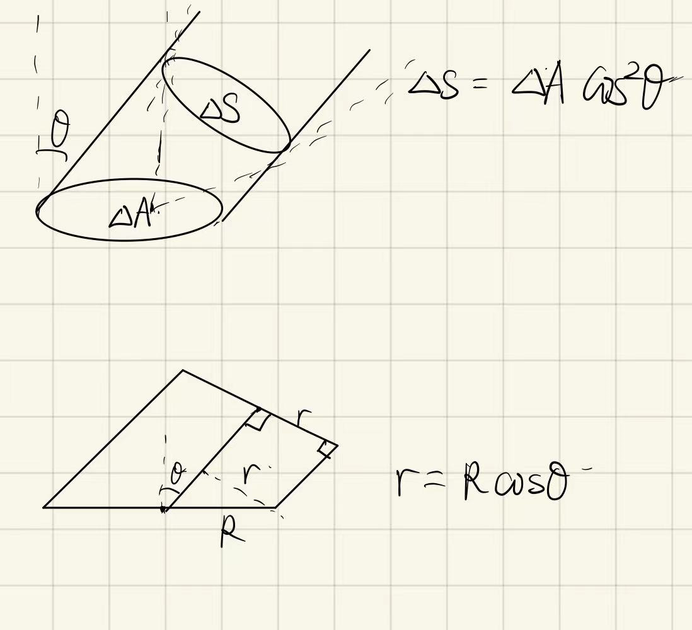
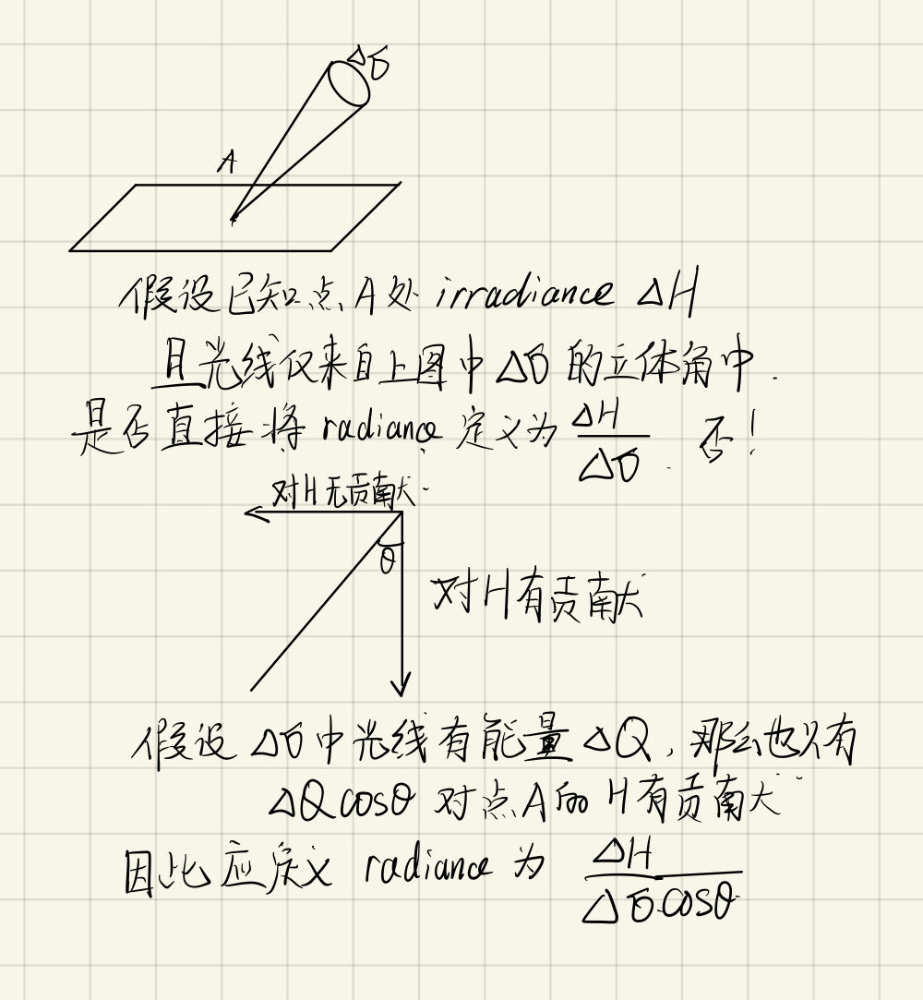
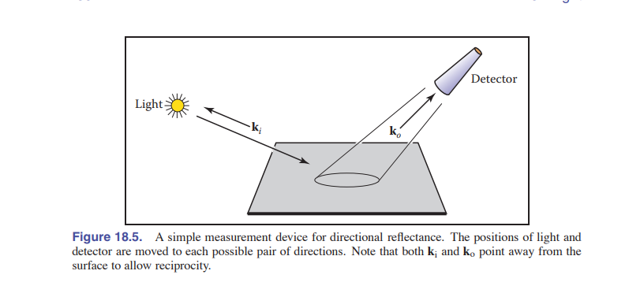

# 18 Light

**这一章将讲解辐照学。**

## 18.1 Radiometry

虽然我们可以在许多系统中定义辐射度单位，但我们使用国际单位制（SI）单位。熟悉的SI单位包括米（m）和克（g）等公制单位。光本质上是一种传播的能量形式，因此定义SI单位的能量单位——焦耳（J），是非常有用的。 

### 18.1.1 Photons

光子具备以下物理量：

1. 能量q(J)
2. 传播速度v(m/s)
3. 频率f(1/s)
4. 波长$\lambda$(nm, or a)

它们的关系/性质有：

- 真空中的光速为c，在不同的传播介质中，传播速度会根据折射率改变，但是频率不变

- $$
  v = \lambda f \tag{18.1.1}
  $$

  

- $$
  q = hf = h\frac{v}{\lambda} \tag{18.1.2}
  $$

  h是普朗克常数。

### 18.1.2 Spectral Energy

根据公式(18.1.2)，**不同频率的光具有不同的能量**。自然光是由不同频率的光混合而成，因此我们自然地想到希望将一束光暗战光谱分解，并且计算出每个频率（或频率区间）的光的能量。这就是光谱上的能量表达。

如果我们采用光子理论，即一束光是由有限的光子聚合而成，那么就可以统计并用直方图表达上面的想法。将频谱分成不同的“BIN“，然后统计落在这个区间中的光子能量综合。为了避免BIN的区间大小的影响，我们可以将其归一化，例如：
$$
Q_{\lambda}[100nm-200nm] = \frac{\sum_{\lambda_i \in [100,200]}q_i}{100}
$$
当$\lambda \to 0$时，事情稍微有一些尴尬，由于量子化的假设，似乎微积分在这里有一些不合时宜。事实上，无论假设光子是离散的进行计算，还是假设其是连续的应用微积分，结果其实是殊途同归的。实验物理学家和搞理论或计算的往往采用不同的观点：

> In practice, it seems that most people who measure light prefer small, but finite, intervals, because that is what they can measure in the lab. Most people who do theory or computation prefer infinitesimal intervals, because that makes the machinery of calculus available. 

记号：我们在下文将采用Q代表$\lim_{\lambda \to 0} \frac{\Delta q}{\Delta \lambda}$

Spectral energy是一种”密度“函数

### 18.1.3 Power

我们现在来考虑光源。在图形学中，光源在一段时间内累计释放的光子的能量是没有意义的，应当考虑能量的时间密度函数(即功率)。常用单位为瓦特(Watt, W, J/S).

我们可以简单估算以下1s中一个100W的光源能够释放多少光子，这里我们忽略光源本身的损失(一个100W的灯，比如，大部分能量转换为热能散失)；假设释放的光子波长为500nm，那么经过近似计算：

1. 单个光子频率：$f = \frac{c}{\lambda} = 6\times 10^{14} s^{-1}$

2. 单个光子能量：$q = hf = 4\times 10^{-19}J$

3. 产生光子数量：$2.5\times 10^{20}$

可见，如果直接模拟光子成像，将是十分inefficiently的。

如果进一步考虑功率在光谱上的密度分布函数，我们可以定义下面的物理量：
$$
\Phi = \frac{\Delta q}{\Delta \lambda\Delta t}	\tag{18.1.3}
$$
单位：$W(nm)^{-1}$

**我们可以这样测量一个光源的spectural power**: 假设有一个具备传感器的测量机器设备在测量光能 ，如果你在传感器前放一个只允许波长区间在 [λ − Δλ/2, λ + Δλ/2] 光经进的色彩过滤器（colored filter），那么波长在 λ 的光谱能(spectral energy)为(18.1.2)， 进一步将读取快门读数进行修改，该快门在以时间 t 为中心的时间间隔 Δt 中打开，光谱功率(spectral power)为 (18.1.3)

### 18.1.4 Irradiance

Irradiance的物理意义：How much light hits this point?

因此，我们进一步将(18.1.3)除以面积微元，得到其二维密度函数
$$
H = \frac{\Delta \Phi}{\Delta A} = \frac{\Delta q}{\Delta \lambda\Delta t \Delta A}
$$
单位是$Jm^{-2}s^{-1}(nm)^{-1}$

>  When the light is leaving a surface, e.g., when it is reflected, the same quantity as irradiance is called radiant exitance, E. It is useful to have different words for incident and exitant light, because the same point has potentially different irradiance and radiant exitance 

当光线离开一个表面，例如反射时，与辐照度相同的量被称为randiant exitance(可以译为辐出度)，用E来表示。对于入射光和出射光使用不同的词是有用的，因为同一个点的辐照度和randiant exitance辐出度可能是不同的。

### 18.1.5 radiance

虽然irradiance已经能够告诉我们每个点能接受到多少光了，**但是irrandiance并没有给出这些光的来源分布**。真正的建模“一束光”，还需要给出光的方向（这里其实假设了光延直线传播）。

定义：
$$
response = \frac{\Delta H}{\Delta A} = \frac{\Delta q}{\Delta \lambda\Delta t \Delta A \Delta\sigma}
$$
但是需要额外注意，$\Delta \sigma$和$\Delta A$ 可能存在一定的角度关系，因此应该加上一个余弦系数进行矫正。

最终，我们定义radiance如下：
$$
radiance = \frac{\Delta q}{\Delta \lambda\Delta t \Delta A \Delta\sigma cos\theta}
$$

> As with irradiance and radiant exitance, it is useful to distinguish between radiance incident at a point on a surface and exitant from that point. Terms for these concepts sometimes used in the graphics literature are **surface radiance** L_s for the radiance of (leaving) a surface, and **field radiance** L_f for the radiance incident at a surface. 

$$
L_s = \frac{\Delta E}{\Delta \sigma cos\theta}\\
L_f = \frac{\Delta H}{\Delta \sigma cos\theta} \tag{18.1.4}
$$

#### 对radiance定义的疑问解答

**重要：比值为什么是$\cos\theta$而不是$(\cos\theta)^2$**

 [【投影的应用】- 图解高等数学 16 - 知乎 (zhihu.com)](https://zhuanlan.zhihu.com/p/26013323) 

  

此时上图中$\Delta A$是椭圆而不是圆（图中$\Delta S = \Delta A \cos^2\theta$错误，应为$\Delta S = \Delta A cos\theta$）

**关于radiance定义推导的另一种思路：**

**randiance是表示一束光线含有能量的物理量**

作为辐照的基本物理量，可以推导出其他物理量。

首先是irradiance:
$$
H = \int_{all\ k}L_f(k)\ cos\theta \ d\sigma	\tag{18.1.5}
$$
实际计算中，**我们需要得知立体角与球坐标之间的关系。**

计算立体角：
$$
d\sigma = \sin \theta \ d\theta \ d\phi
$$
原因参见**第一类曲面积分**，**立体角和单位球面体积微元是等价的。**

同样的，所有的方向k也可以被球坐标表示为：$(\cos \theta \sin\phi,\sin \theta \sin\phi, \cos\phi )$

因此，式(18.1.5)可以被更精确地表述为：
$$
H = \int_{0}^{2\pi}\int_{0}^{\pi}L_f(\theta,\phi)\cos \theta \sin\theta\ d\phi\ d\theta
$$
在多数情况下，我们只需要考虑半球面，因此下式是一般使用的：
$$
H = \int_{0}^{2\pi}\int_{0}^{\frac{\pi}{2}}L_f(\theta,\phi)\cos \theta \sin\theta\ d\phi\ d\theta
$$
进一步，我们可以计算spectral power:
$$
\Phi = \int_{x} H(x) \ dA
$$
注意，与irradiance区分进出不同，power一般不会区分进出。

### 18.1.6 BRDF

**BRDF的测量**

**注：如何理解这里的reciprocity**: [Helmholtz reciprocity - Wikipedia](https://en.wikipedia.org/wiki/Helmholtz_reciprocity) 

> The Helmholtz reciprocity principle describes how a ray of light and its reverse ray encounter matched optical adventures, such as reflections, refractions, and absorptions in a passive medium, or at an interface. It does not apply to moving, non-linear, or magnetic media.
>
> For example, incoming and outgoing light can be considered as reversals of each other,[1] without affecting the bidirectional reflectance distribution function (BRDF)[2] outcome. If light was measured with a sensor and that light reflected on a material with a BRDF that obeys the Helmholtz reciprocity principle one would be able to swap the sensor and light source and the measurement of flux would remain equal.
>
> In the computer graphics scheme of global illumination, the Helmholtz reciprocity principle is important if the global illumination algorithm reverses light paths (for example raytracing versus classic light path tracing).

> Helmholtz互惠性原理描述了光线及其反向光线在被动介质或界面中遇到的匹配光学过程，例如反射、折射和吸收。该原理不适用于运动、非线性或磁性介质。
>
> 例如，可以将入射光和出射光视为彼此的反向过程，而不会影响双向反射分布函数（BRDF）的结果。如果用传感器测量光线，并且该光线在遵循Helmholtz互惠性原理的BRDF材料上反射，可以交换传感器和光源，流量测量结果仍保持相等。
>
> 在全局光照的计算机图形方案中，Helmholtz互惠性原理对于全局光照算法翻转光线路径（例如光线跟踪与经典光线追踪）非常重要

Appearance	Light Transport	Performance**

在计算机图形学中，外观(Appearance)即是对**物体的光学属性建模**。

BRDF是较为基础的一种建模，**它建模了物体表面对光的反射情况**。

 从直觉上来说，对于任何从方向 $k_i$来的入射光，有一部分光散射（scatter）到出射方向 $k_o$附近的小立体角中。我们的目标是正式化这一概念。图18.5是构建一个简单的设备。从表面上一点来看，这里有一个小光源位于方向 $k_i$，并且有一个探测器放在方向 $k_o$上。对每一个方向对 $(k_i,k_o)$ ，我们用探测器测量读数。 

得到的物体表面性质应当与外界无关，即应该与光照强度无关。因此，直接测量得到的值不能作为物体本质的属性，应该将**环境变量消去。**在前面几节介绍的物理量中，radiance最适合用来量化每点每方向接受/发出的辐射强度，而为了消除环境变量的影响，我们自然想象到利用比值，入照/出照的比值很适合作为一个表面的光学性质。
$$
\rho = \frac{L_s}{H}
$$
#### **关键问题：为什么是$\frac{L_s}{H}$而不是$\frac{L_s}{L_f}$**

**答案：**

**1. 测量困难，想要测量$L_f$，需要锥形遮光罩，避免其他立体角的光线射入，但是这也会导致没有光线能够射出遮光罩，导致$L_s$测量困难。**

**2. 我们可以在受到照明的点上放置一个辐射度计来测量光线。然而，为了获得准确的读数，不依赖于探测器的Δσ，我们需要的光线覆盖的立体角大于Δσ。（这解释了为什么不能简单得使用激光）** 

