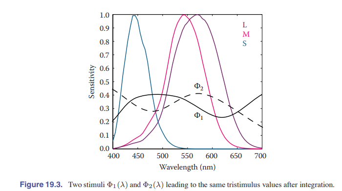

# Chapter 19 Color

光子是光学信息的载体。它们在介质中传播，具有波的特性。在表面边界处，它们与物质相互作用，更像粒子一样行为。它们也可以被视网膜吸收，其中它们携带的信息被转换为电信号，随后由大脑进行处理。只有在大脑中才会产生颜色的感觉 

因此，对于颜色的研究涉及到几个不同的领域：

1. 光在空间中的传播属于物理学范畴。
2. 光与物质的相互作用属于化学领域。
3. 而与颜色感知和认知相关的方面则涉及神经科学和心理学（Reinhard等人，2008年）。

在计算机图形学中，我们通常简化了光在空间中传播的观点。光子沿直线路径传播，直到它们碰到表面的边界，然后根据某种反射函数而被反射。单个光子携带一定数量的能量，这能量由其波长表示。因此，一个光子只有一个波长。其波长λ与携带的能量（ΔE）之间的关系定义为：
$$
\lambda \Delta E = 1239.9\ eV
$$
 在计算机图形学中，模拟单个光子并不高效；相反，通常同时模拟大量的光子集合。如果我们考虑非常大量的光子，每个光子可能携带不同的能量，那么它们在一起代表了一个光谱。光谱可以被看作是一个图形，显示了光子数量随波长的变化。因为两个相同波长的光子携带的能量是单个光子的两倍，所以这个图形也可以被看作是能量随波长的变化。示例光谱如图19.1所示。人类可以感知的波长范围大约在380纳米至800纳米之间（nm）。 下图是一个例子，大概代表了自然光

因此，在模拟光时，我们可以追踪每个光线携带的光谱。能够完成这种模拟的渲染器通常被称为光谱渲染器。从前面的章节可以看出，通常我们不会花费很大代价去构建光谱渲染器。相反，我们用通常使用红色、绿色和蓝色分量的表示来替代光谱。之所以可以这样做，是因为与人类视觉有关，这将在本章后面进行讨论。

通过追踪光线来模拟光，可以处理光的物理性质，尽管需要注意的是，光的几个性质，比如偏振、衍射和干涉，并没有以这种方式进行建模。

 在表面边界处，我们通常通过反射函数来模拟光的行为。这些函数可以通过光度反射仪直接测量，从而产生大量的表格数据，可以用各种不同的函数更紧凑地表示。然而，这些反射函数本质上是经验性的，也就是说，它们忽略了光子被电子吸收和再发射时发生的化学过程。因此，反射函数在计算机图形学建模中很有用，但不能解释为什么某些波长的光被吸收，而另一些被反射。因此，我们不能用反射函数来解释为什么从香蕉反射的光在光谱上呈现为黄色。要解释这个现象，我们需要研究分子轨道理论，这是本书超出范围的话题。 

 最后，当光线到达视网膜时，它被转码为传递到大脑的电信号。大脑的大部分用于处理视觉信号，其中一部分形成了颜色感觉。因此，即使我们知道从香蕉上反射出的光的光谱，我们仍然不知道为什么人类将“黄色”这个词与之关联。此外，在本章的剩余部分中，我们将发现我们对颜色的感知远比乍看之下复杂得多。它会随着光照的改变而变化，在观察者之间有所差异，并且在一个观察者身上随时间变化。 

 换句话说，香蕉发出的光谱是在一个环境的背景下被感知的。要预测一个观察者如何感知“香蕉光谱”，需要了解包含香蕉的环境以及观察者所处的环境。在许多情况下，这两个环境是相同的。**然而，当我们在显示器上显示香蕉的照片时，这两个环境将不同。由于人类视觉感知依赖于观察者所处的环境，观察者可能会以不同于直接观察香蕉的观察者所感知的方式感知照片中的香蕉**。这对于我们如何处理颜色具有重要影响，并说明了与颜色相关的复杂性。 

 颜色的定义：**“颜色是视觉感知的一种方面，观察者可以通过它来区分两个相同大小和形状的无结构视野之间的差异，这种差异可能是由于所观察到的辐射能量的光谱组成不同所引起的”（Wyszecki和Stiles，2000）。实质上，没有人类观察者就没有颜色** 

 幸运的是，我们对颜色的许多了解都可以进行量化，这样我们就可以进行计算，纠正人类视觉的个体差异，从而使显示的图像以设计者的意图呈现给观察者。本章包含了所需的理论和数学知识，以实现这一目标。 

## 19.1  Colorimetry 

色度测量学是关于颜色测量和描述的科学。由于颜色最终是人类的反应，颜色测量应该从人类的观察开始。人类视网膜中的光感受器包括杆细胞和锥细胞。**杆细胞在低光条件下非常敏感（在低光条件下起作用）。在正常光照条件下，锥细胞起作用，调节人类的视觉**。有三种类型的锥细胞，它们共同负责颜色视觉。

虽然可能有可能在呈现某种视觉刺激时直接记录锥细胞的电输出，但这种方法会有侵入性，并且忽视观察者之间的差异，这有时是显著的。此外，大部分颜色测量是在这些直接记录技术可用之前发展起来的。

另一种选择是通过测量人类对颜色块的反应来测量颜色。这导致了颜色匹配实验，这将在本节后面进行描述。执行这些实验已经产生了几个标准化的观察者，可以将它们视为实际人类观察者的统计近似。然而，首先，我们需要描述一些支持颜色匹配可能性的假设，这些假设由格拉斯曼定律总结。

### 19.1.1 Grassmann`s law

考虑到人类有三种不同的锥细胞类型，颜色匹配的实验法则可以总结为**三色一般化**原理（Wyszecki和Stiles，2000），**即任何颜色刺激都可以通过三种适当调制的颜色源的加性混合完全匹配**。这种颜色的特性在实践中经常被使用，例如电视和显示器通过为每个像素添加红色、绿色和蓝色光的混合来再现许多不同的颜色。这也是使用仅三个值来描述每个颜色的原因。

(**What is color matching**:  颜色匹配是一种实验方法，用于确定在给定条件下，可以使用哪些特定颜色的混合来精确地再现或匹配目标颜色。通过颜色匹配，我们可以确定在特定光照条件下，由哪些基本颜色的混合可以产生观察者感知为与目标颜色相同的颜色印象。 **即在这里可以理解为每个颜色如何用三原色match**)

三色一般化原理使我们能够在给定的刺激和三种其他颜色刺激的加性混合之间进行颜色匹配。赫尔曼·格拉斯曼首先描述了颜色匹配遵循的代数规则，这些规则被称为格拉斯曼的加性颜色匹配定律（Grassmann，1853），具体如下：

1. 对称性。 If color stimulus A matches color stimulus B, then B matches A. 
2. 传递性。 If A matches B and B matches C, then A matches C. 
3. 比例性。 If A matches B, then αA matches αB, where α is a positive scale factor.  
4. 加性。 If A matches B, C matches D, and A + C matches B + D, then it follows that A + D matches B + C. 

###  19.1.2 Cone Responses

每种锥细胞类型对一定波长范围内的光敏感，涵盖了大部分可见光谱。然而，对波长的敏感性并不均匀分布，而是包含一个敏感性最大的峰值波长。这个峰值波长的位置对于每种锥细胞类型是不同的。**这三种锥细胞类型被分类为S、M和L锥细胞，其中字母表示短波、中波和长波，指示敏感性峰值位于可见光谱的哪个位置**。 

L,S,M三种视锥细胞对光的敏感性可以被建模为$L(\lambda), S(\lambda), M(\lambda)$，其值域为[0, 1]

假设对于射入的一束光，其光谱为$\Phi(\lambda)$，那么视锥细胞的响应可以被模拟为：
$$
L = \int_{\lambda}\Phi(\lambda)L(\lambda)d\lambda \\
S = \int_{\lambda}\Phi(\lambda)S(\lambda)d\lambda \\
M = \int_{\lambda}\Phi(\lambda)M(\lambda)d\lambda  \tag{19.1}
$$

L, S, M被称为三刺激值(trisimulus)，L(lambda), M(lambda), S(lambda)三个函数被称为spectural cone response function

### 19.1.3 Color Matching Experiments

**同色异谱现象**

阅读资料： [Understanding Image Sensor Metamerism - 知乎 (zhihu.com)](https://zhuanlan.zhihu.com/p/311489591) 

由于公式19.1，我们可以推断出人眼一定存在**条件等色**(**Metamerism**, 或译为 **同色异谱**)的现象。即不同的光谱产生了同样的视觉颜色认知。如下图。

 利用条件等色现象，人们可以使用少数几种光源复现自然界中可能遇到的各种颜色。 这也是显示设备、打印机等色彩显示设备背后的原理。

**颜色匹配实验**

 颜色匹配实验也依赖于条件等色的原理。假设我们有三个颜色不同的光源，每个光源都有一个可以调节其强度的旋钮。我们称这三个光源为基色(primary)。现在，我们应该能够调整每一个光源的强度，这样当它们以加法方式混合在一起时，产生的光谱积分得到的三刺激值(即L, S, M的值)可以匹配第四个未知光源的感知颜色。当我们进行这样的实验时，我们实际上已经将我们的基色匹配到一个未知的颜色。然后，我们三个旋钮的位置就是第四个光源颜色的表示。 

 请注意，我们实际上并不需要知道锥体响应函数来进行这样的实验。只要我们在相同的条件下使用相同的观察者，我们就能够匹配颜色并记录每种颜色的旋钮位置。然而，每次我们想要测量颜色时都要进行这样的实验是相当不便的。因此，我们确实希望知道光谱锥体响应函数，并将它们对一组不同的观察者进行平均，以消除观察者之间的差异。 

### 19.1.4 Standard observer

**标准观察者（standard observer）的色匹配函数** 

 如果我们为大范围的颜色执行一次颜色匹配实验，并由一组不同的观察者来进行，那么我们就可以生成一个平均的颜色匹配数据集。如果我们特定地使用单色光源来与我们的主色进行匹配，我们可以对所有可见波长重复这个实验。得到的三刺激值则被称为光谱三刺激值（spectual trimulus），并可以与波长λ绘制在图19.4中。 

 The Commission Internationale d’Eclairage (CIE) （国际照明委员会？）规定B，G，R三种单色光的波长分别是  **435.8, 546.1, and 700 nm** 

**对上图中负值的解释：** 尽管没有所谓的负光，但我们可以再次使用格拉斯曼定律，不是从主色混合中减去光线，我们可以将同样数量的光线加到正在匹配的颜色上。 

**上面的函数就是我们可以用RGB三刺激值表示颜色的原因。**

补充（https://zhuanlan.zhihu.com/p/311489591）

> 早在1920年代，两位英格兰科学家 W. D. Wright 和 J. Guild 独立地开展了关于色匹配的实验研究。Wright 于1929、1930年间公布了一批实验数据，Guild 于1932年公布了他的数据，其中也引用了Wright 于1929年发表的数据。由于两人的实验是在异地独立开展的，使用了不同的实验方法和基色，在这种情况下两人的数据吻合性非常好，所以尽管参与实验的人数总共只有17人，但是人们对色匹配实验结果仍然抱有充分的信心，并以两人的实验数据为基础制定了CIE-1931 RGB 和CIE-1931 XYZ国际标准。
>
> Wright 和 Guild 的色匹配实验方法非常类似，都是给定一个目标颜色C，寻找合适的三基色系数（α, β, γ）使三基色混合后产生的颜色知觉与 C 相同，大意如下图所示。
>
> 
>
> 实验者会在左侧打出一种颜色的光，然后要求受试者调节手边的三个旋钮控制三基色的发光强度，以匹配左侧的颜色。
>
> 
>
> 
>
> 混色过程用公式表示就是
>
> 
>
> 两人的实验结果都指向一个共同的发现，就是当C是一个光谱色时，人们无论如何也不可能用三个正的系数混合出这个颜色。以波长为500nm的单色光为例，人们必须在目标颜色的基础上增加一点红色成分，才可能用G、B基色混合出与(C500+R)相匹配的颜色，即
>
> 
>
> Wright 和 Guild 引入了“负颜色”的概念来描述这种现象。当你不介意混色系数的正负时，光谱色也可以用三基色混合得到，即
>
> 
>
> 这就是CIE-1931 RGB 颜色空间中负系数的来源。在CIE-1931 RGB 标准中，每个匹配函数都有一些负值，在数学层面这当然没有什么问题，但是对于显示设备制造商来说这却是一个不小的麻烦，因为诸如LED之类的发光设备只能生成正的颜色，不知道如何生成负的颜色。所以，使用CIE-1931 RGB 标准制造的显示设备只能支持一部分颜色，其色域是不完全的。

显然，上面的颜色匹配函数是基于RGB三原色的，因此，如果更改三原色，那么颜色匹配函数与三刺激值自然随之改变，即 可以将一组三刺激值转换为适用于相应的一组原色的另一组三刺激值。

 CIE已经为两个特定原因定义了这样的转换。首先，在1930年代进行数值积分是困难的，对于既可以是正值又可以是负值的函数更是如此。其次，CIE已经开发出视亮度函数（**the photopic luminance response function**）CIE V(λ)。CIE希望有三个积分函数V(λ)是其中一个，并且所有三个在可见范围内都是正值。 

这就诞生了$x(\lambda), y(\lambda), z(\lambda)$及XYZ三刺激值。如下图19.5，在该颜色空间下，颜色匹配函数均为正值函数，且$y(\lambda)$就是视亮度函数$V(\lambda)$

**$x(\lambda), y(\lambda), z(\lambda)$称为标准观察者（standard observer）的色匹配函数**

>  CIE在RGB表色系基础上，改用**三个假想的原色XYZ**建立了一个新的色度系统，将它匹配等能光谱的三刺激值，定名为CIE1931标准色度观察者光谱三刺激值，简称XYZ表色系。经过变换，色度坐标均为正值，XY坐标进行归一化处理，可得到x-y色度坐标，又称CIExyY色度图，其中Y轴用于表示亮度。  

XYZ与RGB的色彩空间变换满足：
$$
\begin{align}
\begin{bmatrix}
X \\
Y\\
Z \\
\end{bmatrix}
=
\frac{1}{0.17697}
\begin{bmatrix}
0.4900 & 0.3100& 0.2000\\
0.17697 & 0.81240& 0.01063\\
0.0000 & 0.0100& 0.9900\\
\end{bmatrix}
\begin{bmatrix}
R \\
G\\
B \\
\end{bmatrix}
\end{align}\tag{19.2}
$$

### 19.1.5 Chromaticity coordinates 色坐标

 在三维色彩空间中可视化颜色是相当困难的。此外，任何颜色的Y值对应其亮度，因为y¯(λ)等于V(λ)。因此，我们可以将三刺激值投影到一个近似色度信息（即与亮度无关的信息）的二维空间中。这个投影称为色度图，并通过规范化同时去除亮度信息。 
$$
x = \frac{X}{X+Y+Z}\\
y = \frac{Y}{X+Y+Z}\\
z = \frac{Z}{X+Y+Z}\tag{19.3}
$$
注意到$z = 1- x-y$，因此在绘制二维平面色度图时省略z。

但注意只要给定$x, y, Y$,就可以恢复XYZ
$$
X = \frac{x}{y}Y\\
Y = Y\\
Z = (1-x-y)\frac{Y}{y}\tag{19.4}
$$

 一个（非单色）原色可以在所有可见波长上进行积分，从而得到（X，Y，Z）三刺激值，随后得到（x，y）色度坐标，即色度图上的一个点。重复这个过程对两个或更多的原色，可以得到一组在色度图上的点，这些点可以用直线连接起来。以这种方式跨越的面积表示着可以通过这些原色的加性混合所复制的颜色范围。在图19.7中展示了三原色系统的示例。 

**？此处存疑**
$$
\mathbf{c_1} = (x_1, y_1)^T, \mathbf{c_2}=(x_2, y_2)^T, \mathbf{c_3} = (x_3, y_3)^T\\
\mathbf{c} = (x, y)^T = (\mathbf{c_1, c_2, c_3})(\alpha, \beta, \gamma)^T\\
X =\frac{ \alpha x_1+\beta x_2 + \gamma x_3}{\alpha y_1 + \beta y_2+\gamma y_3}Y
$$

 色度图对加性色彩混合提供了洞察。然而，使用时需要小心。首先，马蹄形图的内部不应着色，因为任何色彩再现系统都有其自己的原色，并且只能再现色度图的某些部分。其次，由于CIE色匹配函数并不代表人类锥细胞的敏感性，因此色度图上任意两点之间的距离并不是判断这些颜色在感知上有多大差异的好指标。 

 出于至少部分解决这些问题的考虑，开发了一个更统一的色度图。CIE u-v色度图提供了更加感知均匀的间距，因此通常优先使用它，而不是(x, y)色度图。它通过应用不同的规范化方式，从(X, Y, Z)三刺激值计算得到。 
$$
u = \frac{4X}{X+15Y+3Z}\\
v = \frac{9Y}{X+15Y+3Z}
$$

## 19.2 Color Spaces

每种颜色可以用三个数字表示，例如由（X，Y，Z）三刺激值定义。然而，其原色是虚构的，也就是说，不可能构建一个具有三个（全部为正值）光源的设备，可以复制可见光谱中的所有颜色。

基于同样的原因，XYZ在图像编码和图像处理可能并不实用。例如，存在大量可能的XYZ值，它们并不对应任何物理颜色。这将导致存储时可用位的低效利用，并要求更高的位深度才能在图像处理后保持视觉完整性。虽然可能可以构建一个捕捉设备，它的原色与CIE XYZ色匹配函数接近，但硬件成本和图像处理的成本使得这不是一个有吸引力的选项。不可能构建与CIE XYZ相对应的显示设备。因此，有必要设计其他的色彩空间：物理可实现性、高效编码、感知均匀性和直观的颜色规范化。

 **CIE XYZ色彩空间仍然广泛用于与其他色彩空间之间的转换，这是因为它可以被视为一种与设备无关的色彩空间。** 

 其他色彩空间可以通过其与CIE XYZ的关系来定义，通常通过特定的转换来指定。例如，线性和加法式的三色显示设备可以通过一个简单的3×3矩阵与CIE XYZ之间进行转换。还可以指定某些非线性的额外变换，例如在使用有限位深度存储数据时最小化感知误差，或者在直接在存在输入信号和发射光量之间非线性关系的设备上进行显示时实现。 

### 19.2.1 Constructing a matrix tranformation

**推导RGB空间与XYZ空间的变换**

设R，G，B三个原色光在XYZ中对应分别为$(X_i, Y_i, Z_i),i\in\{R, G, B\}$，且其色坐标为$(x_i, y_i, z_i),i\in\{R, G, B\}$。

RGB空间中，三原色坐标为(1, 0, 0)，(0, 1, 0)，和(0, 0, 1)，其混合的白光为(1, 1, 1)，白光的XYZ坐标及色坐标为$(X_w, Y_w, Z_w)$和$(x_w, y_w, z_w)$

由公式19.3，我们定义
$$
S_i = \frac{Y_i}{y_i}={X_i+Y_i+Z_i}, i\in\{R, G, B\}
$$
那么有：
$$
X_i = x_iS_i\\
Y_i = y_iS_i \\
Z_i = z_iS_i = (1-x_i-y_i)S_i
$$
通过解方程组：
$$
X_w = x_RS_R+x_GS_G+x_BS_B\\
Y_w = y_RS_R+y_GS_G+y_BS_B\\
Z_w = z_RS_R+z_GS_G+z_BS_B\tag{19.5}
$$
可以解除S_R, S_G, S_B的值，进而：
$$
\begin{align}
\begin{bmatrix}
X \\
Y\\
Z \\
\end{bmatrix}
=

\begin{bmatrix}
x_RS_R & x_GS_G & x_BS_B\\
y_RS_R & y_GS_G & y_BS_B\\
z_RS_R & z_GS_G & z_BS_B\\
\end{bmatrix}
\begin{bmatrix}
R \\
G\\
B \\
\end{bmatrix}
\end{align}\tag{19.6}
$$
**以上推导成立的根基在于：不同颜色空间之间的映射满足线性，这是真的吗？我认为这只是一种假设，一种简化，事实上，这成为Luther-Ives条件，这里暂不深究。**

 **sRGB**是一种标准的RGB色彩空间，其中的"s"代表标准（standard）。它是为了实现在不同设备上显示一致颜色而设计的，是广泛应用于电子设备、互联网和数字媒体的常见色彩空间。 

**sRGB规定了：**

1. Primaries（原色）的定义：sRGB定义了特定的原色值，通常用红色、绿色和蓝色（RGB）来表示。这些原色的坐标值被规定为标准值，以确保在不同设备上呈现的颜色一致性。
2. 白点（White point）的定义：sRGB定义了一个标准白点，用于表示纯白的色彩。sRGB中的白点被定义为D65，这是一种在CIE标准光源中最接近自然光的白点。
3. Gamma校正：sRGB使用一种称为sRGB gamma的非线性校正，用于提高在显示设备上进行色彩表现时的视觉感知一致性。这种gamma校正对于在不同设备上查看图像和保持一致的色彩外观至关重要。

因此，**标准的sRGB与XYZ的变换可以表示为**：

并进行非线性校正：

### 19.2.2 Device-dependent RGB spaces

 由于每个设备通常具有自己的原色和白点集合，我们将相关的RGB色彩空间称为**设备相关**的。

值得注意的是，即使所有这些设备都在RGB空间中操作，它们的原色和白点可能会有很大的差异。因此，如果我们有一个在某个RGB空间中指定的图像，在不同的设备上显示时可能会呈现非常不同的外观。

如果图像在已知的RGB色彩空间中指定，首先可以将其转换为与设备无关的XYZ空间，然后再将其转换为将要显示图像的设备的RGB空间。

还有一些其他明确定义的RGB色彩空间。它们每个**都由一个线性矩阵变换和一个非线性变换组成**，类似于前面提到的sRGB色彩空间。非线性变换可以用以下方式参数化： 
$$
R_d = \begin{cases} (1+f) R^{\gamma}-f \ \ \ \ \ \ \ t\lt R\le 1\\sR\ \ \ \ \ \ \ \ 0\le R\le t\end{cases} \\
G_d = \begin{cases} (1+f) G^{\gamma}-f \ \ \ \ \ \ \ t\lt G\le 1\\sG\ \ \ \ \ \ \ \ 0\le G\le t\end{cases} \\
B_d = \begin{cases} (1+f) B^{\gamma}-f \ \ \ \ \ \ \ t\lt B\le 1\\sB\ \ \ \ \ \ \ \ 0\le B\le t\end{cases} \\
$$

### 19.2.3 LMS Cone Space

### 19.2.4 CIE 1976 L* a* b*

 色对立空间的特点是具有代表非色彩通道（亮度）的通道，以及编码颜色对立的两个通道。通常是红-绿和黄-蓝通道。这些色对立通道可以沿一个轴编码两个色度，这些色度可以具有正值和负值。例如，红-绿通道对于正值编码红色，对于负值编码绿色。数值零表示一个特殊情况：中性，既不是红色也不是绿色。黄-蓝通道的工作方式与此类似。 

 由于每个色度轴上至少编码了两种颜色，因此无法同时编码红色和绿色的混合色。也无法同时编码黄色和蓝色。虽然这可能看起来有些不利，但已知人类视觉系统在视觉通路的早期阶段计算类似的属性。因此，人类无法感知同时具有红色和绿色，或者黄色和蓝色的颜色。我们不会看到类似红绿色或黄蓝色的颜色。然而，我们能够感知到一些颜色的混合，比如黄红色（橙色）或绿蓝色，因为它们在色度通道上被编码。 

CIELAB即CIE L* a* b* 就是一种色对立空间

## 19.3 Color Adaption

人类视觉系统通过一种称为适应的过程来适应环境的变化。可以区分三种不同类型的适应，分别是**光适应、暗适应和色彩适应**。

**光适应**( Light adaption )指的是当我们从非常暗的环境转移到非常明亮的环境时发生的变化。当这种情况发生时，一开始我们会被光线刺眼，但很快我们适应了新的情况，开始分辨环境中的物体。

**暗适应**( Dark adaption )指的是相反的情况-当我们从明亮的环境转移到黑暗的环境时。一开始，我们几乎看不到什么，但经过一定的时间，细节会开始显现出来。适应到黑暗环境所需的时间通常比光适应更长。

**色彩适应**( Chromatic adaptation )指的是我们适应并在很大程度上忽略照明颜色变化的能力。**本质上，色彩适应是与大多数现代相机上的白平衡(White Balance)操作相当的生物学等效**。人类视觉系统有效地对观察条件进行归一化，以呈现相对一致的视觉体验。因此，我们表现出一定程度的色彩恒常性：尽管照明变化，物体反射的色度似乎相对恒定。

尽管我们在很大程度上能够忽略观察环境的变化，但我们并不能完全做到这一点。例如，在晴天和阴天，颜色的外观会有很大的差异。尽管外观发生了变化，但我们并不认为物体的反射本身实际上改变了其物理属性。因此，我们理解到光照条件会影响整体颜色的外观。 

**色彩适应的计算模型**通常侧重于锥细胞中的增益控制机制。其中一种最简单的模型假设每个锥细胞独立地适应吸收的能量。这意味着不同类型的锥细胞根据所吸收的光谱以不同的方式进行适应。这种适应可以被建模为对锥细胞信号进行自适应和独立的重新缩放： 
$$
L_{\alpha } = \alpha L \\
M_{\alpha} = \beta M \\
S_{\alpha} = \gamma S \tag{19.7}
$$
适应照明可以通过场景中的白色表面进行测量。在理想情况下，这将是一个朗伯表面。在数字图像中，适应照明也可以近似为场景的最大三刺激值。通过这种方式测量或计算得到的光是适应白光，由(Lw, Mw, Sw)表示。**von-Kries adaption**则简单地通过在锥细胞响应空间进行适应白光的倒数缩放来实现：
$$
\begin{align}
\begin{bmatrix}
L_{\alpha} \\
M_{\alpha}\\
S_{\alpha} \\
\end{bmatrix}
=

\begin{bmatrix}
\frac{1}{L_w} & 0 & 0\\
0 & \frac{1}{M_w} & 0\\
0 & 0 & \frac{1}{S_w}\\
\end{bmatrix}
\begin{bmatrix}
L \\
M\\
S \\
\end{bmatrix}
\end{align}\tag{19.8}
$$
 在许多情况下，我们感兴趣的是在一种照明条件下生成的三刺激值，以匹配在另一种照明条件下给定的颜色。**例如，如果我们有一个受到日光照射的彩色图案，我们可能会问自己在白炽灯光照射下应该生成什么三刺激值来创建一个匹配的颜色图案。这时，只需要应用两次变换19.8即可** 

存在着一些更复杂、因此更准确的色彩适应转换方法（Reinhard等人，2008年）。然而，简单的冯·克里斯模型在模拟色彩适应方面仍然非常有效，因此可以用于在数字图像中实现白平衡。

在渲染过程中，色彩适应的重要性在于我们向着考虑观察者的观察环境又迈进了一步，而无需通过调整场景并重新渲染图像来进行校正。相反，我们可以对场景进行建模和渲染，然后在图像后处理中校正观察环境的照明。然而，为了确保白平衡不会引入伪影，重要的是确保图像呈现为浮点格式。如果呈现为传统的8位图像格式，色彩适应转换可能会放大量化误差。

## 19.4 Color Appearance

虽然色彩度量学使我们能够以与设备无关的方式准确指定和传达颜色，而色彩适应使我们能够在照明变化下预测颜色匹配，但这些工具仍然不足以描述实际的颜色外观。

要预测对象的实际感知，我们需要更多关于环境的信息，并将这些信息纳入考虑。人类视觉系统不断适应其环境，这意味着颜色的感知会受到这些变化的强烈影响。颜色外观模型考虑到刺激本身的测量结果以及观察环境。这意味着所得到的颜色描述与观察条件无关。

颜色外观建模的重要性可以通过以下示例看出。考虑在LCD屏幕上显示的图像。当将同一图像打印出来并在不同的环境下观看时，图像往往会看起来明显不同。颜色外观模型可以用于预测所需的变化，以生成准确的跨媒体颜色再现（Fairchild，2005年）。

尽管颜色外观建模为颜色再现提供了重要的工具，但实际实现在实际使用中往往相对复杂且繁琐。可以预见，随着时间的推移，这种情况可能会发生变化。然而，在那之前，我们将其描述留给更专门的教材（Fairchild，2005年）。